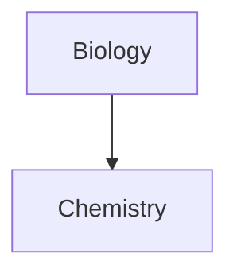
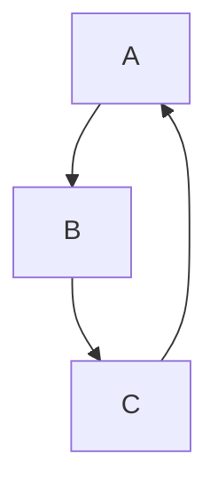
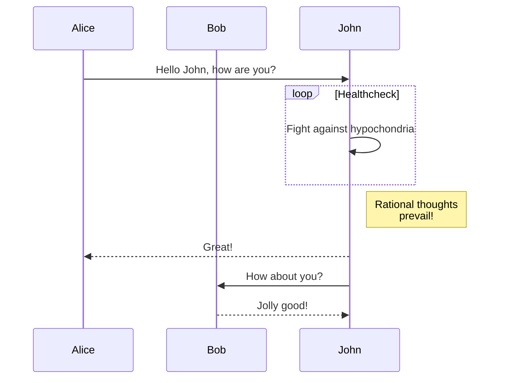

# Title 1
## Title 2
### Title 3
#### Title 4
##### Title 5
###### Title 6

*Text in italics*
_Text in italics_

**Text in bold**
__Text in bold__

~~Text in strike through~~

This is an unordered list
- List item 1
- List item 2
	- Sub-item

This is an ordered list
1. List item 1
2. List item 2
	1. Sub-item

This is a pasted image
![[Pasted image 20210330214329.png]]

This is a link
[Mark Down Cheat Sheet](https://guides.github.com/pdfs/markdown-cheatsheet-online.pdf)

This is a quote
> A rising tide lifts all boats

Escape characters
\*The Great Escapist\*

Code `snippet` with language
```python
print("Hello World!")
```

Task list
- [x] List item 1
- [ ] List item 2
	- [ ] Sub-item

Table
```md
|:Header 1|Header 2:|
|---------|----------|
|:Column 1|Column 2:|
```

Embedding
![[https://www.youtube.com/watch?v=aS6mH8TTFR4]]

Highlighting text
This text is ==highlighted==

Here is an example of footnotes
- Footnotes are useful to provide more information[^!]
- These is another example[^footnotes]


Footnotes: 
[^1]: Just like this!
[^footnote]: Yep, like this
			Testing more information
			
Here are some comments:
%%
Hello World!
%%
You can't see comments in the preview

Graphs from [Mermaid](https://mermaid-js.github.io/mermaid/#/)

Here is a live [editor](https://mermaid-js.github.io/mermaid-live-editor/#) for Mermaid



Another Mermaid diagram


Another one


Here is a #tag/nested-tag

Here is a [[link]]
